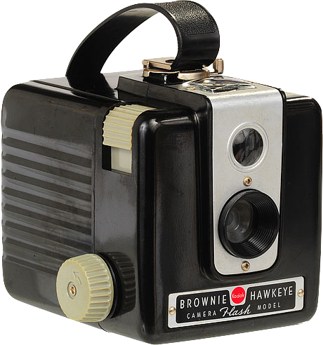

# Raspberry Hawkeye

[Kodak Brownie Hawkeye](http://kenrockwell.com/trips/2010-02-rt-66/contact-sheet.htm) 

## Connecting to the Hawkeye

### Using the [USB to TTL cable](http://www.adafruit.com/products/954)

#### on OSX

Install PL2303 drivers

```bash
screen /dev/cu.usbserial 115200  
```

#### on
 Linux

```bash
sudo apt-get install screen
sudo screen /dev/ttyUSB0 115200
```